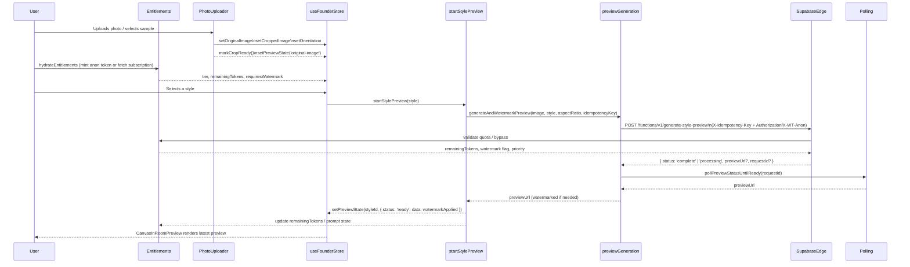

# Wondertone Preview Flow (Current)

**Notes**

- Anonymous sessions call `anon-mint` to persist tokens and prompt state; authenticated sessions read `v_entitlements`.
- Supabase edge function enforces quotas, idempotency, and watermark rules; response includes `remainingTokens` and `requires_watermark`.
- Client watermarking only runs when the edge function indicates it is required.
- Orientation changes reuse cached previews when possible; otherwise they trigger `startStylePreview` with an overridden orientation.
